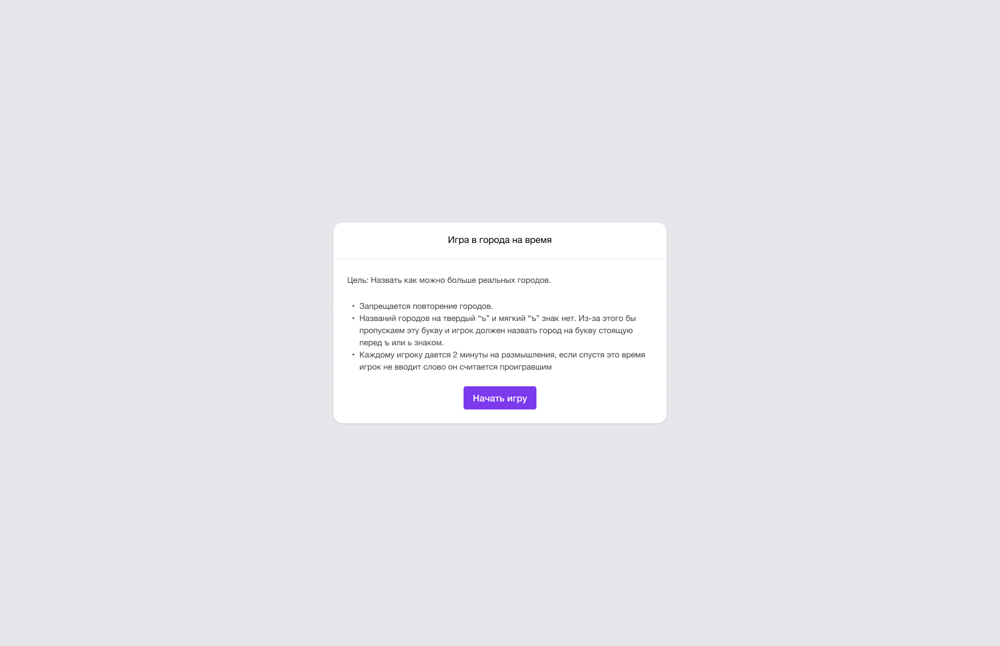
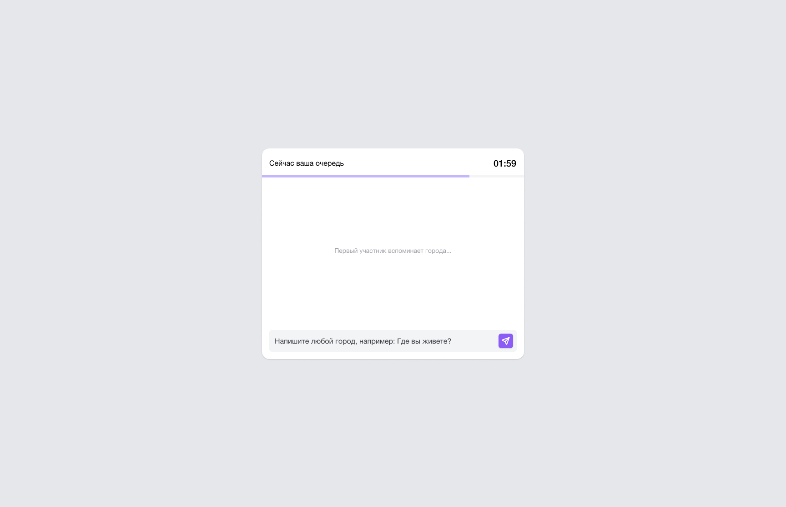
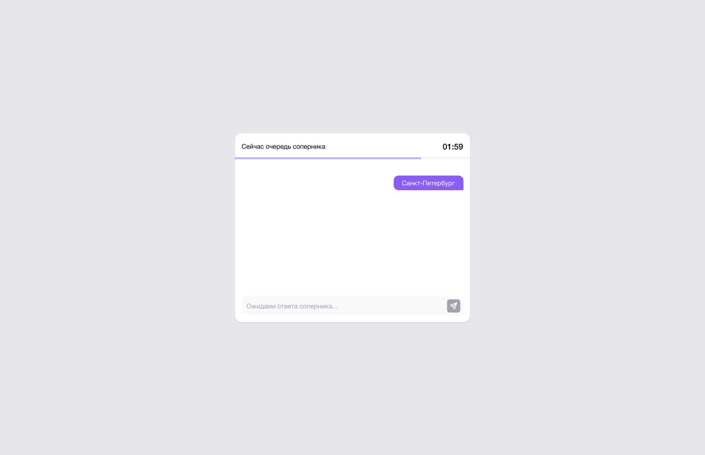
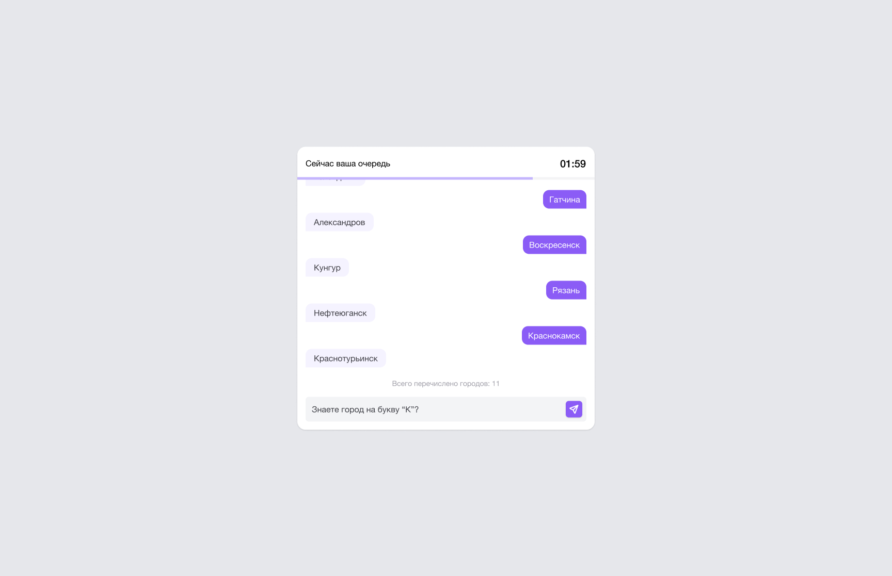
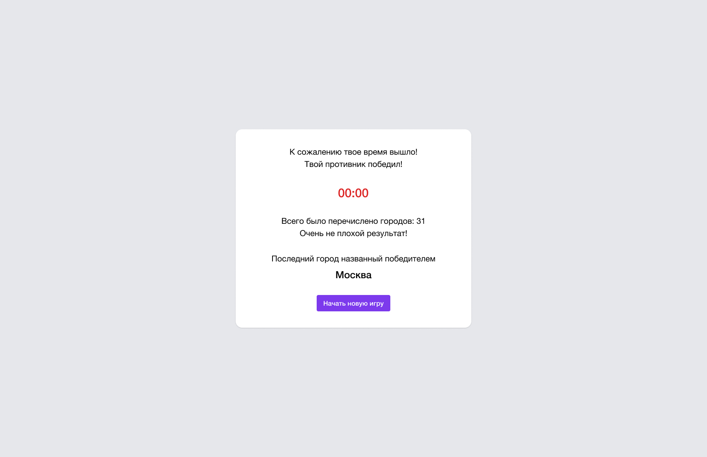
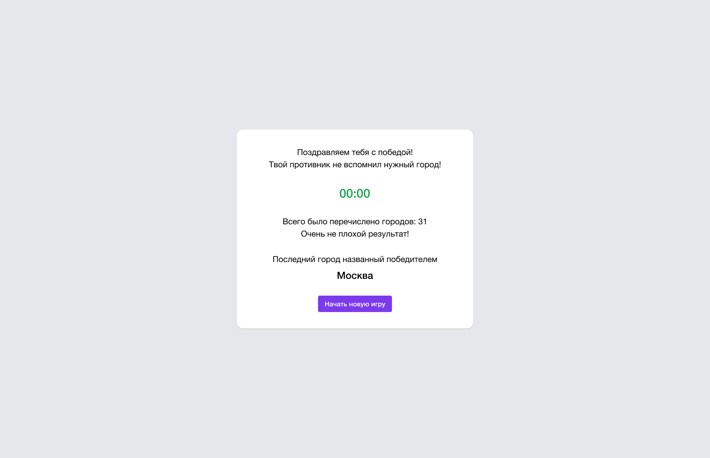

# Тестовое задание для frontend-разработчика

Привет!

Это страничка тестового задания для вакансии на frontend-разработчика в команду Personik.

Задание расчитано на ~3-4 часа. Что мы проверяем:

- Верстка, кроссбраузерная, адаптивная, применение Tailwind
- Умение работать с макетом в Figma
- Умение разделять код на компоненты
- Умение писать осознанные коммиты
- Умение предлагать варианты для решения поставленной задачи
- Код стайл, аккуратность (желательно использование prettier)
- Стремление к развитию, не бойся делать ошибки

## Задача

Необходимо разработать "легкую" версию онлайн-игры в "Города".

В качестве оппонента, мы предлагаем тебе написать функцию, которая будет брать города из заготовленного списка (список городов прилагается в репозитории). Главное не забудь учитывать правила игры – города не могут повторяться.

Для имитации живого игрока нужно написать функцию так, чтобы ответ от нее приходил с задержкой.

В репозитории есть макет для Figma, в котором ты можешь найти финальный дизайн для игры.
Обрати внимание на отступы, выравнивания по центру, на размерности.

В первой вкладке расположен макет, во второй tailwindcss конфигурация (она соответсвует конфигурации по умолчанию).

Все размеры в макете подходят под размеры tailwind классов. Например: максимальная ширина окна - 576px, соответсвует классу max-w-xl.

Для работы над текстом в первом слайде рекомендуем использовать класс `.prose` из tailwind плагина [Typography](https://tailwindcss.com/docs/typography-plugin)

Так же необходимо реализовать таймер обратного отсчета, по умолчанию на 2 минуты. Если игрок или функция "ИИ" не успеет дать нужный ответ, мы можем определить победителя и проигравшего.

Для более качественной работы необходимо добавить валидацию вводимых городов на существование (1), по первой букве (2) и на повторение (3). 

## Стек и технические требования

- React 18
- Tailwind
- Использование typescript желательно

Роутинг делать не обязательно, если тебе будет достаточно работы в одном родительском компоненте.

Pixel Perfect оценивать не будем, но жирным плюсом будет, если классы из tailwind будут верно подобраны и подходить под размеры макета.

Решение должно быть выложено в публичном репозитории на github, чтобы можно было его проверить.

В остальном требований к проекту нет, можно использовать любые вспомогательные библиотеки на твой вкус (такие как day.js для работы с датой и тд).
Будет плюсом, если ты умеешь обходится без "готовых компонентов".

## Рекомендуемый порядок работы

- [ ] Развернуть и настроить проект (не забудь про prettier, gitignore)
- [ ] Сверстать макет из Figma
- [ ] Разбить верстку на компоненты
- [ ] Определить файловую систему
- [ ] Определить формат данных и место для хранения городов
- [ ] Реализовать логику для иммитации ответов
- [ ] Реализовать логику начала игры, ответов пользователя, состояние ожидания ответа
- [ ] Соеденить логику иммитации ответов с логикой ответов пользователя
- [ ] Немного поиграть
- [ ] Реализовать валидацию ввода города по существованию (1) по первой букве (2) и повторения города (3)
- [ ] Поиграть и проверить валидацию
- [ ] Добавить таймер для ответов
- [ ] Добавить рандомную генерацию таймера для логики имитации ответов (10-121 сек)
- [ ] Реализовать сценарий победы
- [ ] Реализовать сценарий поражения
- [ ] Поиграть, поиграть, поиграть

## Результаты

Присылай нам вариант решения в виде ссылки на github репозиторий.

Если тебе что-либо не удалось реализовать, прикладывай пояснение к своей работе для общего разбора полетов. Мы приветсвуем любые результаты, даже если у тебя что-то не получается реализовать.

Желательно добавить в репозиторий README файл, в котором описать решение, процесс развертывания, и любые комментарии, которые мы должны учесть при проверке задания.

Если возникают любые вопросы по заданию - пиши нам, ответим на все вопросы без исключения!

Желаем успехов! Надеемся, что задание окажется интересным!

## Скриншоты игры

  

  

  

  

  

  

